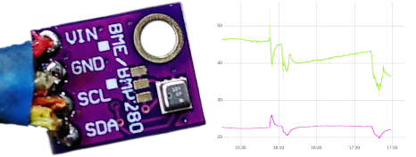
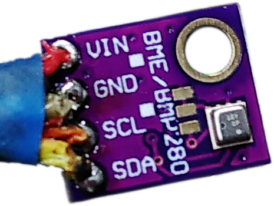
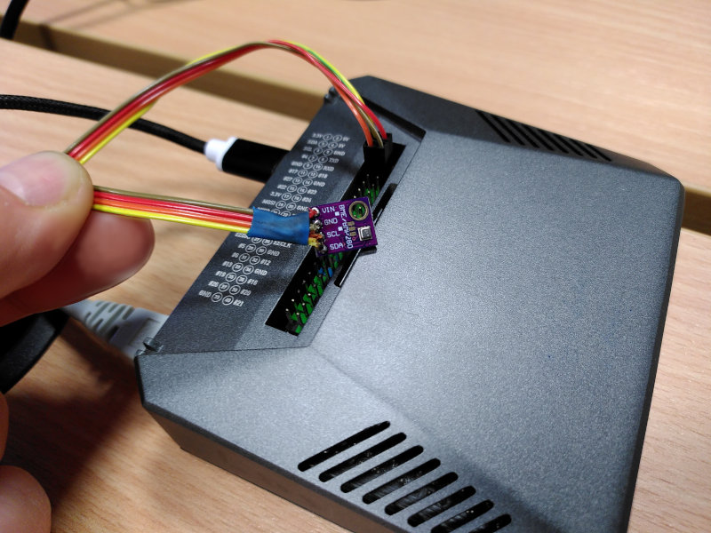

# BME280 into MetricQ

Getting Humidity, Temperature and Pressure into MetricQ.


## The Big Picture



## Hardware

There's a variety of sensors for Measuring Humidity. A prerequisite for measuring `relative humidity` is information on `temperature`. There's a wide variety of sensors for this purpose, which shall be omitted for brevity purposes here.


### BME280

Bosch's sensortec series provides us with the [BME280 sensor](https://www.bosch-sensortec.com/products/environmental-sensors/humidity-sensors-bme280/). It can mesaure:
- `relative humidity`
- `temperature`
- `barometric pressure`

Unless you are very capable at miniature soldering 8 pins with a distance of just 0.55 mm between the connection pads, you might want to fetch some BME280 pre-soldered on a PCB[*] from some electronics retailer.

Similar sensors: GY-21, HTU21D/SHT21 (Note: adjust the I²C address for those sensors)

Further Reading:
- [BME280 Datasheet](https://www.bosch-sensortec.com/media/boschsensortec/downloads/datasheets/bst-bme280-ds002.pdf)
- [BME280 Mounting Instructions](https://www.bosch-sensortec.com/media/boschsensortec/downloads/handling_soldering_mounting_instructions/bst-bme280-hs006.pdf)


[*] PCB is shorthand for Printed Circuit Board

### Raspberry Pi

Here we are using Raspberry Pi 4 with Argon One V.2 housing here. However the BME280 sensor can be connected to even a simple Raspberry Pi 1 A.

Follow some other Online tutorial on how to setup your raspberry pi including putting some debian-ish operating system on it.

### I2C Introduction

For brevity purposes we'll assume you got some BME280 sensor on a PCB providing [I²C](https://en.wikipedia.org/wiki/I%C2%B2C) on four Pins. We will not concern ourselves with SPI here, because it requires two more pins to work and I²C's frequency/Baud-rate is far far sufficient for reading a few small numbers.

Your sensor and PCB might look a little something like this:


Do note the four pins here:
- Vin: Voltage Input (i.e. Polarity: Positive (+); 1.71 - 3.6 volt[*])
- Gnd: Ground (i.e. Polarity: Negative (-))
- SCl: Serial Clock
- SDa: Serial Data

[*] Note on the Voltage: the metallic looking 2.5 x 2.5 mm sensor by Bosch would be destroyed with a voltage higher than 3.6 V. However, this particular PCB comes with a series of Resistors and Capacitors which allow us to run 5.0 - 5.2 V (provided by the Raspberry Pi) to the PCB without problems.

### I2C wiring.

Simply run the four aforementioned Pins to the Raspberry Pi into the respective Ports. For simplicity see this table here on the Raspberry Pi pinout:

| Description    | Pin | Pin | Description    |
|----------------|-----|-----|----------------|
| 3.3 Volt       |   1 |   2 | 5 Volt         |
| **I2C1 SDA/GPIO2** |   3 |   4 | **5 Volt**         |
| **I2C1 SCL/GPIO3** |   5 |   6 | **Ground**         |
| GPIO4/GPCLK0   |   7 |   8 | GPIO14/UART TX |
| Ground         |   9 |  10 | GPIO15/UART RX |
| GPIO17         |  11 |  12 | GPIO18/PCM CLK |
| ...            | ... | ... | ...            |

(for a complete reference see [the Pinout.xyz site](https://pinout.xyz/))

I marked the Pins 3, 4, 5 and 6 which I've been using. For providing 3 Volts instead, you might choose to use Pin 1 (3.3 Volt) instead of Pin 4.

### Completed Hardware Setup



(See [here for a high resolution image](img/metricq-bme280.jpg))

## Software

So, you got all the hardware ready, now you want to install the pre-requisites for running a MetricQ-Source.

Note: a **MetricQ-Source** (i.e. some sensor) creates data which can be sent to a **MetricQ-Server** to be thereafter consumed by a **MetricQ-Sink** (e.g. a database).

### Speaking I2C

So first-off, we want to make sure, that we got the I²C communication established. Particularly the following steps:
1. Enabling I²C
2. Query used Adresses on the I²C bus
3. Dump Data

So on the command line call `sudo raspi-config`, navigate into the menu for `Interface Options`, and enable `I2C` therein.

Then install the I²C tools with `sudo apt install i2c-tools`. And thereafter invoke `i2cdetect 1`, which will print something like this:
```console
username@raspberrypi:~ $ i2cdetect 1
WARNING! This program can confuse your I2C bus, cause data loss and worse!
I will probe file /dev/i2c-1.
I will probe address range 0x08-0x77.
Continue? [Y/n] Y
     0  1  2  3  4  5  6  7  8  9  a  b  c  d  e  f
00:                         -- -- -- -- -- -- -- -- 
10: -- -- -- -- -- -- -- -- -- -- -- -- -- -- -- -- 
20: -- -- -- -- -- -- -- -- -- -- -- -- -- -- -- -- 
30: -- -- -- -- -- -- -- -- -- -- -- -- -- -- -- -- 
40: -- -- -- -- -- -- -- -- -- -- -- -- -- -- -- -- 
50: -- -- -- -- -- -- -- -- -- -- -- -- -- -- -- -- 
60: -- -- -- -- -- -- -- -- -- -- -- -- -- -- -- -- 
70: -- -- -- -- -- -- 76 --
```

Thereafter you can query the device on that adress by invoking `i2cdump 1 0x76` which will hopefully yield a lot gibberish from line 9 onwards.  If instead it only shows a lot of "XXXXXXXXXXXXXXXX" then that means that unfortunately no data can be read from that address.

### Software-Pre-Requisites

You need a bunch of dependencies, particularly:
- a Python>=3.10
- git
- adafruit_sensor
- adafruit-circuitpython
- adafruit-circuitpython-bme280


Thereafter run:
```bash
git clone https://github.com/metricq/metricq-source-example
cd metricq-source-example
pip3 install .
```

### Programming

Now you can adapt the `source.py`.

Importing the libraries and initializing them:
```python
from adafruit_bme280 import basic as ada_bme280
import board
[...]
        # use the default board.SCL and board.SDA
        i2c = board.I2C()
        self.bme = ada_bme280.Adafruit_BME280_I2C(
                i2c=i2c,
                address=0x76)

[...]
```

Tell the Server your Metadata:
```python
[...]
    logger.info("BmeSource received config: {}", config)

        self.period = 1 / rate  # type: ignore #  https://github.com/python/mypy/issues/3004

        self.metric_prefix = prefix
        all_metadata = {
            f"{prefix}.humidity": {
                "rate": rate,
                "description": "Relative Humidity in the office (accuracy about 3 %RH with an additional hysteresis of 1 %RH)",
                "unit": "%RH"
            },
[...]
        await self.declare_metrics(all_metadata)
[...]
```

Actually read and send the data:
```python
    async def update(self) -> None:

        # Send temperature at the current time:
        await self.send(
            f"{self.metric_prefix}.humidity",
            time=metricq.Timestamp.now(),
            value=self.bme.humidity,
        )
[...]
```


### Systemd-Unit

(write Something on run.sh here..)

```systemd
[Unit]
Description=A MetricQ Data Source (utilizing a BME280 sensor)
After=network.target
Documentation=https://metricq.github.io/metricq-python/

[Service]
Type=simple
EnvironmentFile=/home/username/metricq-source-example/env-metricq-server-connection
User=username
Group=username
# Apparently we need to wait a little longer than just 5 seconds when restarting, because of this MetricQ error message:
# Failed to connect BmeSource: RESOURCE_LOCKED - cannot obtain exclusive access to locked queue
ExecStartPre=/usr/bin/sleep 20
ExecStart=/home/username/metricq-source-example/run.sh
Restart=on-abort

[Install]
WantedBy=multi-user.target
```